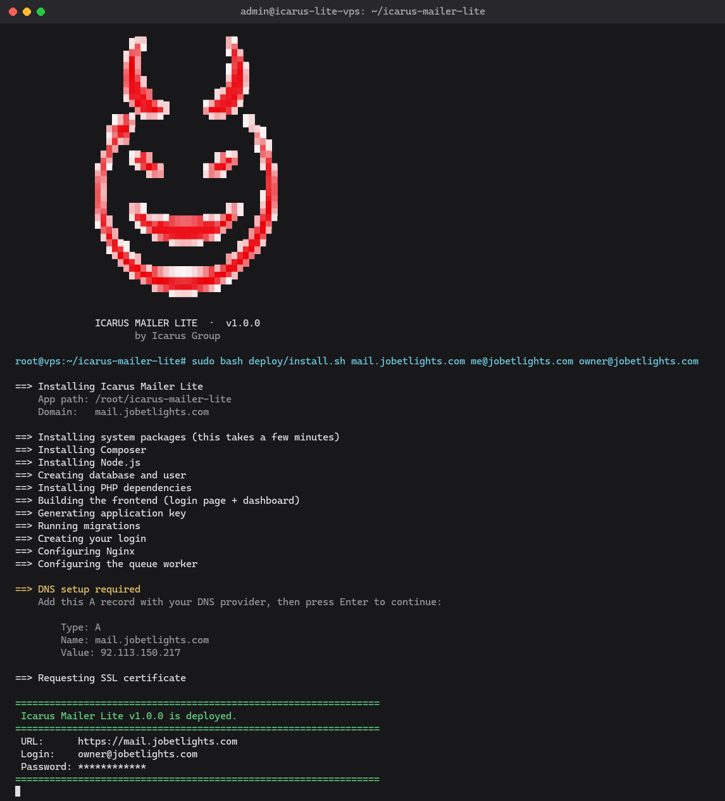

# Icarus Mailer Lite

A minimal, open-source cold email / campaign sending API — SMTP account management, templates, recipient lists, and campaign sending with basic round-robin SMTP rotation.

This is the free, stripped-down sibling of **Icarus Mailer Pro Enterprise**, which adds:

- Adaptive SMTP selection (health scoring, reputation gating, hourly rate-limit-aware rotation)
- Proxy-based sending-location masking
- Automatic DKIM signing per sending domain
- Deliverability testing: seed-account inbox placement checks, auto-pause/resume on spam-folder detection
- Bulk email validation and catch-all/MX-based domain intelligence
- Multi-provider sender-domain automation (Mailgun, SendGrid, Brevo, Mailjet, and more)
- A full email sorter/segmentation pipeline and mailbox automation
- A Telegram bot for remote campaign control

**→ [Icarus Mailer Advanced](https://icarus0x0.com/)**

## What's included

- A login page and dashboard (React) — SMTP servers, templates, recipient lists, campaigns
- SMTP account CRUD + live test-send
- Email templates
- Recipient lists (paste emails or JSON)
- Campaigns: create, launch, pause, resume
- Simple round-robin rotation across your active SMTP accounts
- Token-based API auth (Laravel Sanctum) — the dashboard is just a client of the same `/api/*` endpoints documented below

## What's intentionally left out

Everything listed above under Pro Enterprise. This is a deliberately "lite" build — see Icarus Mailer Pro Enterprise for production-scale sending infrastructure.

## Requirements

- PHP 8.2+
- Composer
- Node.js 18+ (only needed to build the dashboard — not required at runtime)

No external database server is required — this ships configured for SQLite out of the box.

## Setup

```bash
composer install
cp .env.example .env
php artisan key:generate
touch database/database.sqlite
php artisan migrate
php artisan app:create-admin you@example.com   # prints a generated password once
```

Build the dashboard (one-time, or whenever you change `frontend/`):

```bash
cd frontend
npm install
npm run build   # outputs into ../public/app — served at /app
cd ..
```

Then run the app:

```bash
php artisan serve
```

Visit `http://localhost:8000/app` and log in with the email/password `app:create-admin` printed. In a separate terminal, run a queue worker (campaigns send asynchronously):

```bash
php artisan queue:work
```

For frontend development with hot reload instead of a static build, run `npm run dev` inside `frontend/` (proxies `/api` to `php artisan serve` on port 8000 — see `frontend/vite.config.ts`).

## Deploying to a fresh Ubuntu VPS

`deploy/install.sh` sets up a complete production instance on a fresh Ubuntu 22.04/24.04 server in one run: PHP 8.3, MariaDB (with a freshly generated database password), Node.js (to build the dashboard), Composer, Nginx, a Supervisor-managed queue worker, a free Let's Encrypt SSL certificate, and your login (with a randomly generated password, printed once at the end).



### Step by step

1. **Point a domain at nothing yet — you'll add the DNS record mid-install.** You just need the domain name decided (e.g. `mail.yourdomain.com`).

2. **Get a fresh Ubuntu 22.04 or 24.04 server** (any provider) and SSH in as a user that can `sudo`, or as `root`.

3. **Clone the repo:**

   ```bash
   git clone https://github.com/Icarus0x0/icarus-mailer-lite.git
   cd icarus-mailer-lite
   ```

4. **Run the installer**, replacing the domain and both emails with your own:

   ```bash
   sudo bash deploy/install.sh mail.yourdomain.com you@yourdomain.com owner@yourdomain.com
   ```

   - Arg 1: the domain this instance will be served on
   - Arg 2: your email, for Let's Encrypt renewal notices
   - Arg 3: the email you'll log in with (your dashboard login)

5. **When the script pauses and shows an A record**, add it at your DNS provider:

   ```
   Type: A
   Name: mail.yourdomain.com
   Value: <the IP the script printed>
   ```

   Then press Enter in the terminal. The script polls DNS every 10 seconds for up to 5 minutes and requests the SSL certificate automatically once it resolves. If it times out before your DNS provider propagates, it tells you the exact `certbot` command to run yourself once it has.

6. **Save the credentials printed at the end** — they are not stored anywhere and won't be shown again:

   ```
   URL:      https://mail.yourdomain.com
   Login:    owner@yourdomain.com
   Password: <randomly generated>
   ```

7. **Log in** at `https://mail.yourdomain.com/app` with that email and password.

That's it — SMTP accounts, templates, recipient lists, and campaigns are all managed from the dashboard from here.

### Notes

- **DNS is the only manual step.** No script can point your domain at a server without your DNS provider's API credentials — everything else (packages, database, app, SSL, queue worker) is fully automated.
- **This script is meant to be run once**, against a fresh server. Re-running it is safe (it won't overwrite an existing `.env` or clobber your database password), but to add a *second* login, don't re-run the installer — instead run this directly on the server:

  ```bash
  cd /path/to/icarus-mailer-lite
  php8.3 artisan app:create-admin someone-else@yourdomain.com
  ```

- **Queue worker:** campaigns send asynchronously through a Supervisor-managed worker (2 processes) named `icarus-lite-worker`.

  ```bash
  sudo supervisorctl status icarus-lite-worker:*     # check it's running
  tail -f storage/logs/worker.log                    # view its logs
  ```

- **Updating an existing install:** pull the latest code, then rebuild and reload:

  ```bash
  git pull
  composer install --no-dev --optimize-autoloader
  (cd frontend && npm ci && npm run build)
  php artisan migrate --force
  php artisan config:cache && php artisan route:cache
  sudo systemctl reload php8.3-fpm
  sudo supervisorctl restart icarus-lite-worker:*
  ```

## API quick start

```bash
# Register
curl -X POST http://localhost:8000/api/register \
  -H "Content-Type: application/json" \
  -d '{"name":"You","email":"you@example.com","password":"password123","password_confirmation":"password123"}'

# Use the returned token for everything below
TOKEN="..."

# Add an SMTP account
curl -X POST http://localhost:8000/api/smtps \
  -H "Authorization: Bearer $TOKEN" -H "Content-Type: application/json" \
  -d '{"name":"My SMTP","host":"smtp.example.com","port":587,"username":"user","password":"pass","encryption":"tls","from_email":"me@example.com","from_name":"Me"}'

# Create a template
curl -X POST http://localhost:8000/api/templates \
  -H "Authorization: Bearer $TOKEN" -H "Content-Type: application/json" \
  -d '{"name":"Welcome","subject":"Hi there","html_body":"<p>Hello!</p>","text_body":"Hello!"}'

# Create a recipient list (paste emails, one per line — "email,name" also works)
curl -X POST http://localhost:8000/api/recipient-lists \
  -H "Authorization: Bearer $TOKEN" -H "Content-Type: application/json" \
  -d '{"name":"My list","emails":"a@example.com\nb@example.com,Bob"}'

# Create and launch a campaign
curl -X POST http://localhost:8000/api/campaigns \
  -H "Authorization: Bearer $TOKEN" -H "Content-Type: application/json" \
  -d '{"name":"Test Campaign","subject":"Hello","template_id":1,"recipient_list_id":1}'

curl -X POST http://localhost:8000/api/campaigns/1/launch -H "Authorization: Bearer $TOKEN"
```

## Endpoints

| Method | Path | Description |
|---|---|---|
| POST | `/api/register` | Create an account |
| POST | `/api/login` | Get an API token |
| POST | `/api/logout` | Revoke the current token |
| GET | `/api/me` | Current user |
| GET/POST | `/api/smtps` | List / create SMTP accounts |
| PUT/DELETE | `/api/smtps/{id}` | Update / delete an SMTP account |
| POST | `/api/smtps/{id}/test` | Send a live test email |
| GET/POST | `/api/templates` | List / create templates |
| PUT/DELETE | `/api/templates/{id}` | Update / delete a template |
| GET/POST | `/api/recipient-lists` | List / create recipient lists |
| GET/DELETE | `/api/recipient-lists/{id}` | View / delete a list |
| GET/POST | `/api/campaigns` | List / create campaigns |
| GET/DELETE | `/api/campaigns/{id}` | View / delete a campaign |
| POST | `/api/campaigns/{id}/launch` | Launch a draft campaign |
| POST | `/api/campaigns/{id}/pause` | Pause a sending campaign |
| POST | `/api/campaigns/{id}/resume` | Resume a paused campaign |

## License

MIT — see [LICENSE](LICENSE).
